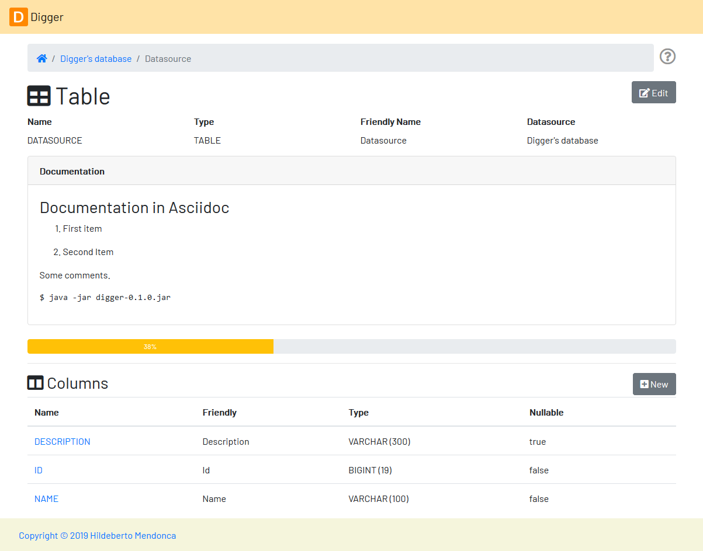

# Digger

Use Digger to document your relational database because applications go but the database stays. The name "digger" is a tribute to a co-worker who never gives up when facing a challenge at work. She only rests when the problem is solved.

## Running Digger

1. Download the latest release from the [release page][releases].
2. Save the digger-<version>.jar in the folder you want to install it.
3. Run it with the command: `$ java -jar digger-<version>.jar`
4. Open the application by visiting the address https://localhost:8080
 
## Using Digger

Digger is a user friendly tool and you probably can get along by simply using it. But in case you need more detailed information please read Digger's [User Guide][userguide]. It also provides contextual guidance when you click on the help button on the top right of the user interface.

## Contributing to the Project

Follow these instructions if you want to contribute to Digger.

### Assumptions

We assume your development environment is configured with:
 
 - **Java 8+**: you can perform the commands `java` and `javac` in your terminal
 - **Maven 3**: you can perform the command `mvn` in your terminal
 - **Git**: you can perform the command `git` in your terminal

### Local Environment Setup

We favor the use of the command line to setup the local environment, so we do not depend on any other tool for this basic step. Open the Windows terminal and start by cloning the repository in your local machine:

    $ cd [your-java-projects-folder]
    $ git clone https://github.com/htmfilho/digger.git

It creates the folder `digger` that contains the entire source code application. Execute the following Maven command to build, test, and run the application:

    $ cd digger
    $ mvn spring-boot:run

Visit the local address http://localhost:8080/ to use the application. To stop it, type `Ctrl+C` on the terminal. 

### Development Experience

Your changes to Java files take effect as soon as you save them. Spring DevTools makes sure they are compiled and deployed automatically, so you don't have to do it yourself.

### Deployment

Create a deployment package using Maven:

    $ mvn clean package

It creates a Java standalone application package in the folder `target`.

If the default port `8080` is already in use, set the environment variable `SERVER_PORT` to `8081`.

Run the package to check if everything works:

    $ cd c:\java\apps\digger
    $ java -jar digger-<version>-SNAPSHOT.jar

[releases]: https://github.com/htmfilho/digger/releases
[userguide]: http://www.hildeberto.com/digger/
