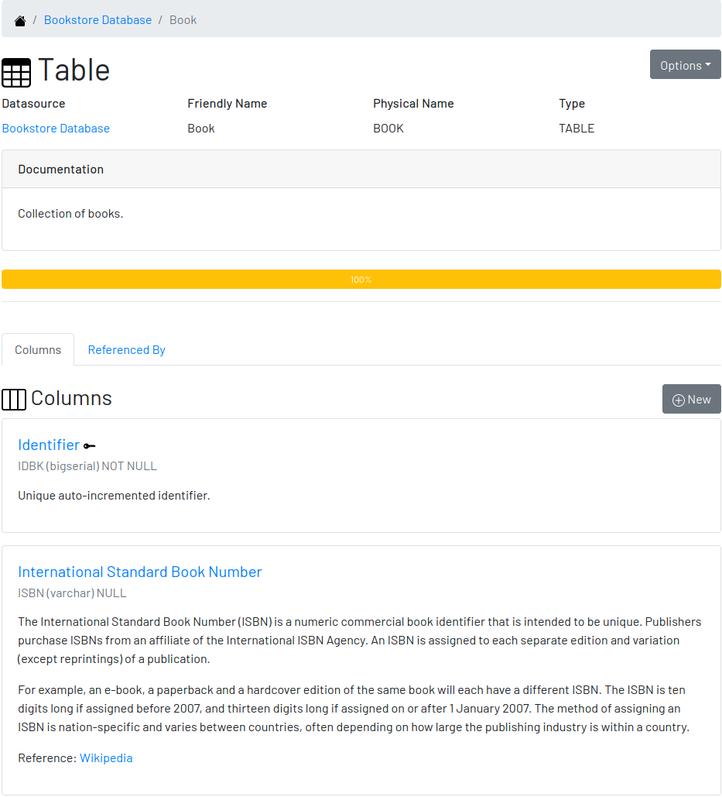

# Digger

Use Digger to document your relational databases. It is a web application that works like a supporting tool for DBAs and Developers, making sure data is well understood. Everybody in the organization can contribute to the knowledge base.

## Documentation 

To learn how to install, configure and use Digger, please follow the [User Guide].

## License

[GPL] - GNU GENERAL PUBLIC LICENSE Version 3

Copyright (C) 2019-2022 Hildeberto Mendonca

This program is free software: you can redistribute it and/or modify
it under the terms of the GNU General Public License as published by
the Free Software Foundation, either version 3 of the License, or
(at your option) any later version.

This program is distributed in the hope that it will be useful,
but WITHOUT ANY WARRANTY; without even the implied warranty of
MERCHANTABILITY or FITNESS FOR A PARTICULAR PURPOSE.  See the
[GNU General Public License][GPL] for more details.

[user guide]: https://www.hildeberto.com/digger/
[GPL]: https://github.com/htmfilho/digger/blob/master/LICENSE
