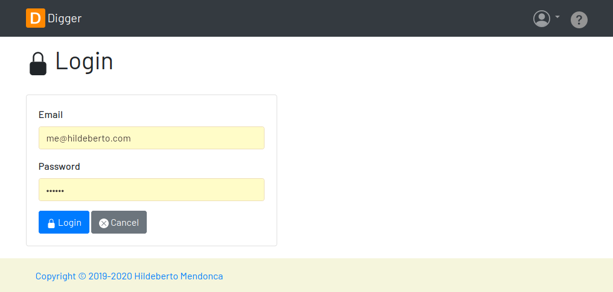
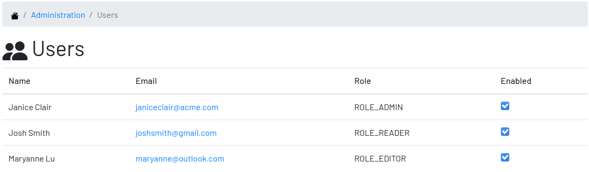
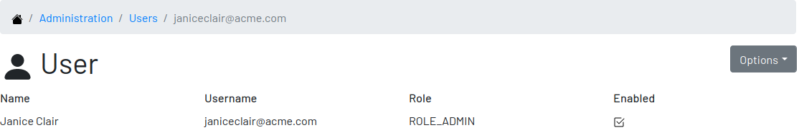
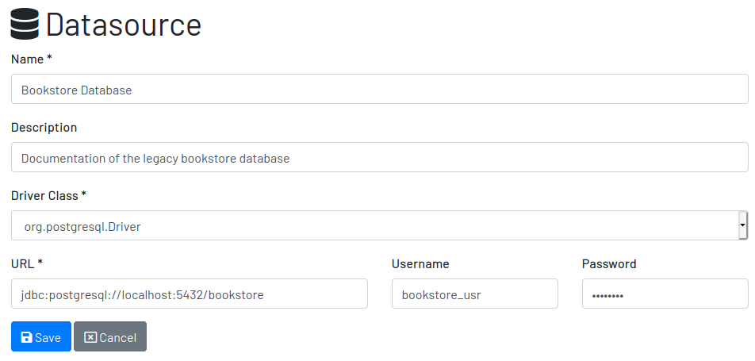

= Digger : Documenting Database Schemes
Hildeberto Mendonca <me@hildeberto.com>
v1.9.0
:doctype: book
:pdf-page-size: LETTER
:encoding: utf-8
:toc: left
:toclevels: 3
:numbered:

> Digger is a light-weight web application to centralize and share the accumulated collective knowledge about all the relational databases of the organization."

:sectnums!:

== Why Do We Need Digger?

After decades of software development, we realized that data is more valuable than software. An application is more likely to be rewritten in a modern platform and continue pointing to an existing database than an existing application be modified to access data from a different database. Of course both cases exist, but applications tend to become more chaotic over time due to the frequency of changes and the mix of technologies.

Even with a longer time span, databases are rarely documented. Often, developers have to read the code to understand the meaning of tables, views, columns, and how they are used. It is not rare to find columns and tables that are not referenced at all, but we never know whether they are still in use by an obscure trigger, stored procedure or third-part application. If at least they had an defragmented and up-to-date documentation they could rely on.

=== Database Documentation Approaches

To address the documentation issue, we have identified approaches that projects usually follow to manage the knowledge around the database.

==== Model Based

The most traditional way of documenting database schemas is the relational diagram. Modelling tools such as Enterprise Architect are largely used to design the tables, views and their relationships. Those tools provide extensive support to any level of documentation and reporting capabilities. The graphical representation of the schema is useful on the design phase because it makes the data abstraction visible, helping on the discussions, refinements and identification of flaws. The creators of Digger use the relational diagram on the conception and evolution of Digger's database. Unfortunately, modelling tools are expensive, and their cost increases with the number of collaborators. To keep costs low, companies limit the use of data modelling to a few key users. The tool in its own is not enough. They need a server to synchronize and share the models. To keep the models up-to-date is also a challenge. Small changes, optimizations, temporary tables and views implemented in run-time rarely make the way back to the models. Therefore, there is clearly a gap to be bridged.

==== DDL Based

Another approach to document database schemas is to do it directly in the DDL script. The data definition language support comments by placing two dashes before the text to be ignored during the execution of the script. It is perfectly possible to follow this path, but not recommended. The reason is that database structures are not defined in a single script anymore. Databases now evolves gradually, with small scripts making small changes at every deployment in production. The spread of documentation in several files, some of them outdated due to subsequent changes in the same structures, makes this approach unmanageable.

==== ORM Based

An alternative approach would be to use object-relational models where the documentation would be written in entity classes, directly in the source code of the application. It puts the content face to face with developers, the main beneficiaries of the documentation, enables low cost collaboration and sharing among all people involved, and version controlled. However, it would make this documentation inaccessible or difficult to be consumed by other roles such as business analysts, data analysts, DBAs and other non-technical roles.

=== Digger's Approach

The approach adopted by Digger is to document schemes only when they are physically present in the database. That is a pragmatic approach in the sense that time is spent on documentation only when all design decisions were already materialized. The tool uses a database connection to a up-to-date database, makes its metadata accessible, and allow users to describe the elements with content that is instantly accessible to all interested stakeholders.

The weakness of the wiki based is the difficulty to see the big picture. The content is favoured over structure. Time is spent explaining the utility of the columns or why that table breaks a normal rule, but not how they look like on the types of the columns or the foreign keys, since they are already defined.

This approach is complementary to the modelling. While the last focus on database design and the first on documentation.

Here is where Digger comes to play. It offers a new approach for database documentation. Instead of working with diagrams, scripts, and tools, Digger relies on schemes that are already materialized in the database server. Digger offers great value on documenting older databases because they have lower probability of having up-to-date modelling and supported tools. For new databases, diagrams are useful to prevent design flaws, improve communication, and expressiveness, but as time passes, the schema goes through frequent changes, and the diagram gets rapidly outdated. Here comes Digger, helping to socialize knowledge about the schema, making documentation available to a larger audience.

Documenting seems to be boring and unnecessary in most cases. A clear naming convention and attention to database design rules would be self explanatory. However, some unorthodox decisions are made to improve performance and  corporate data dictionaries might be enforced, making it difficult to ensure readability. To cover these cases, documentation becomes as important as test automation, ensuring that developers always know how to use all parts the system. Digger helps to minimize the individual effort by making database documentation a collective effort.

Documenting is also an intellectual exercise that leads to more knowledge and creativity. The more we write about the data the more insights we have about its use. When we make writing a collective effort, and not an individual struggle, the volume of new insights is exponentially higher. Digger estimates the collective effort to document data just like Wikipedia stimulates the collective effort to document the human knowledge.

:sectnums:

== Getting Started

Digger is easy to install as long as its requirements are already in place. It requires Java 8 or superior installed and configured in the system. The application comes with an embedded database for simple use cases, but it can also be configured to store data in a PostgreSQL database server, which also has to be installed and configured separately.

=== Installing the Released File

New versions of Digger are published in the https://github.com/htmfilho/digger/releases[release page]. If you have an old version installed you can fearlessly upgrade it to the newest version. Download the latest version - which is a `jar` file with the naming convention `digger-<version>.jar` - and go for a standalone or a server installation as explained below.

==== Standalone Installation

To run Digger with its default configuration, go to the terminal and execute:

    $ cd <path-to-digger-folder>
    $ java -jar digger-1.3.0.jar

A few moments later, open your browser and visit the address http://localhost:8080 to use Digger with its embedded database. The folder `data` is automatically created during the initialization and the sign up page below is presented by default.

.Initial Setup

==== Server Installation

The embedded database is robust enough to support a reasonable volume of data, but it won't scale to support multiple concurrent users. For that, you can use PostgreSQL to handle a larger demand for information. To switch to PostgreSQL:

1. if the application is already running, stop it using `[Ctrl+C]` in the terminal

2. create a sub-directory named `config` in the same directory of the application

3. download the files https://raw.githubusercontent.com/htmfilho/digger/master/config/application.properties[`application.properties`] and https://raw.githubusercontent.com/htmfilho/digger/master/config/application-server.properties[`application-server.properties`] and save them in the `config` folder

4. open the file `application.properties` and change the following entry from `embedded` to `server`:

    spring.profiles.active=server

5. Then open the file `application-server.properties` and change the following connection parameters to your PostgreSQL server:

    spring.datasource.driver-class-name=org.postgresql.Driver
    spring.datasource.url=jdbc:postgresql://localhost:5432/digger
    spring.datasource.username=digger_usr
    spring.datasource.password=secret

6. Restart the application to take the new configuration into account:

    $ java -jar digger-1.2.0.jar

7. Finally, refresh the page http://localhost:8080

Make sure the database user has full rights over Digger's database, so it can generate the schema and perform all operations.

=== Installing From Source

A new version of Digger is released from time to time, but if you can't wait for a feature that was just finished, then you may need to build Digger from the source. To do it, you need:

 - https://openjdk.java.net/[JDK], a Java Development Kit to compile and run the code,

 - https://maven.apache.org/[Maven], a traditional software life-cycle management tool for Java, and

 - https://git-scm.com/[Git], a distributed version control system. Please, visit their respective documentation and get them installed and configured in your system.

To start, fetch the code from GitHub:

    $ git clone https://github.com/htmfilho/digger.git

`git clone` fetches the entire repository to the local machine, all commits since day 1. Every clone is a copy of the entire repo. If the server is lost, the repo can be easily recovered from the most updated copy.

Build the project:

    $ cd digger
    $ mvn package

All the artifacts you need are ready! The jar file is now available at `target/` and the configuration files at `config/`. You can run it using the java command:

    $ java -jar target/digger-1.2.0.jar

or Maven:

    $ mvn spring-boot:run

If you already have Digger installed, just put the generated jar file in the same folder of the existing installation and remove the old jar. Execute the new jar from that point on.

You can also get all subsequent changes whenever they are available by merging the remote master branch into the local master branch:

    $ git pull origin master

Then you can package and run it:

    $ mvn clean package

=== Installing as a Service

Sometime, we spend so much time documenting database schemes that we want Digger to be constantly available. We also want it to restart with the operating system in case it needs to boot. Digger can be configured to start as a local service to address these cases. This facility to run applications as a service is available in most operating systems.

==== A Linux Service

On Linux, a service for Digger is configured by creating a new service file `digger.service` at `/etc/systemd/system` with the following content:

----
[Unit]
Description = Digger - Database Schema Documentation Tool

[Service]
Type=simple
WorkingDirectory=/opt/digger
User=digger
Group=digger
StandardOutput=syslog+console
StandardError=syslog+console
ExecStart=/usr/bin/java -jar /opt/digger/digger-standalone.jar

[Install]
WantedBy=multi-user.target
----

Then execute the following commands:

    $ sudo systemctl daemon-reload
    $ sudo systemctl enable digger.service

==== A Windows Service

On Windows 10, a service for Digger is configured as follows:

1. create a dedicated folder for the application

2. download the latest version from the release page and save it in the dedicated folder.

3. the downloaded file name contains the release number, but to simplify future upgrades, replace the release number by "service". For example:

  digger-1.3.0.jar -> digger-service.jar

4. download the Windows Service Utility, choosing the file that corresponds to your .net version. If you don't know your .net version, just peak the most recent one.

5. save the file in the dedicated folder and rename it to `digger-service.exe`

6. create an XML file in the same folder, name it `digger-service.xml`, and put the following content in it:

  <service>
    <id>digger-service</id>
    <name>Digger Service</name>
    <description>Digger: database schema documentation.</description>
    <executable>java</executable>
    <arguments>-jar "digger-service.jar"</arguments>
    <logmode>rotate</logmode>
  </service>

7. Go to the command line, navigate to the dedicated folder and execute the command:

  $ digger-service.exe install

=== Creating the PostgreSQL Database

==== On Linux

Execute the following commands to install PostgreSQL:

    $ sudo apt-get install postgresql
    $ sudo su - postgres -c "createuser -s $USER"

Then create the database for the application:

    $ createdb digger
    $ createuser digger_usr -P
    $ psql -d digger
      =# grant connect on database digger to digger_usr;
      =# \q

== Security

Digger ensures that only authorized people in the organization are allowed to document and to access the documentation of the schemes. Users are managed by the application and their passwords are strongly encrypted in the database, to the point they cannot be recovered, only reset.

[#signup]
=== Signing Up

When Digger starts for the first time, it forces the creation of the first user account by automatically redirecting the user to the Sign Up page. The role of administrator (ROLE_ADMIN) is automatically assigned to the first user, who is empowered to manage the application including other users.

.User Sign Up
image::images/signup.png[]

All people signing up after the first user are *disabled* and assigned to the role of *Reader* by default. That's why the user cannot login after the sign up. The administrator must enable the user and assign him or her to the appropriate role or leave the user as reader. Learn more in the section <<enabling-disabling-user>>.

[#login]
=== Login

The login tries to match the user's credentials. If the matching is successful then the user is allowed into the application to access confidential information, otherwise the user is informed that the matching was unsuccessful.

.User authentication

[#profile]
=== User Profile

Once the login is successful, users have access to their profile by clicking on the user's menu on the top right and selecting *Profile*. This section gives information and control over the user experience.

.User Profile

[#change-password]
==== Changing Password

One of the capabilities available in the profile is the password change. Users are able to change their password whenever they feel it can improve their security. To change your password:

1. Click on the *Change Password* button available in the profile

2. fill in your current password to confirm your identity

3. fill in your new password in the *New Password* and *Confirm New Password* fields

4. Click on *Submit* to confirm the change or *Cancel* to return to the profile

.Changing Password
image::images/change-password.png[]

=== Protection Against CSRF

CSRF stands for https://en.wikipedia.org/wiki/Cross-site_request_forgery[Cross Site Request Forgery], a malicious exploit of web applications where unauthorized commands are triggered from users trusted by the application. Digger implements the measures to prevent this kind of attack.

== Features

Digger gives you a good set of features to help you document the database schemes of your organization.

[#admin]
=== Administration

The administration is accessible via the top menu, in the "Admin" option. It allows the administrator to check environment configuration and manage user accounts.

image::images/administration.png[]

NOTE:: This feature is limited to administrators. Other roles won't see this option in the menu.

[#admin-environment]
==== Environment

Sometime, the administrator needs to know how the application was configured in order to diagnose issues and properly manage it. The environment section lists the properties taken into account by the application.

[#admin-users]
==== Users

Administrators need to have control over the users to ensure the confidentiality of the information managed by Digger. They can find in this section the essential to manage the users.

[#enabling-disabling-user]
===== Enabling and Disabling a User

After signing up, a user doesn't have instant access to Digger. All users are disabled by default and the administrator has to enable them. To enable a user:

1. click on the "Admin" option on the top menu and select "Users" in the list
2. check the users you want to enable and uncheck the ones you want to disable

[#admin-user]
===== User's Details

In the *User's Details* section, the administration can see all information related to the user and related options such as *Edit* and *Delete*.

.User's Details

===== Changing the Role of a User

Digger defines 3 levels of authority represented by roles. They are:

- *Administrator*: has access to all functionalities of the system.

- *Editor*: has rights limited to document and visualize the documentation of the schemas.

- *Reader*: has rights limited to visualizing the documentation of the schema.

The first user of Digger is assigned to the role of Administrator and all subsequent users are assigned to the role of Reader. Only the administrator has the right to change the role of a user. To do this:

1. Click on the "Admin" option on the top menu and select "Users" in the list
2. click on the user you want to change
3. click on the button "Options" and select "Edit" in the list
4. select the role you want for that user and save

The only exception is when there is only one administrator and he or she tries to change his or her own role of administrator. The administrator needs to promote another user as administrator to be able to downgrade his or her own role.

image::images/user-form.png[]

[#datasources]
=== Datasources

Datasource is a reference to an existing database that we intend to document. A datasource has enough information to connect to the database and extract metadata from it.

image::images/datasources.png[]

[#datasource-form]
==== Creating and Editing a Datasource

To create a new datasource, click on the *New* button on the top right of the list of datasources. It opens the datasource form, where you can give it a *Name*, give more details about it in the *Description*, and inform the connection attributes. The *Driver Class* drop-down field offers a list of the currently supported database engines. Each driver requires a different URL format, so when a driver is selected, its corresponding URL template appears below the *URL* field for reference. Finally, inform a valid *Username* and *Password* with at least _Read_ privileges to the database. Click on *Save* to register the information or *Cancel* to go back to the datasource list.

To edit a datasource, click on it in the list. In the datasource page, click on the button *Options* on the top right, then select the option *Edit*. The same form appears, but this time completely filled. Make the intended changes and *Save*.

[#datasource]
==== A Datasource

The datasource page shows all information related to the datasource, as well as all possible operations such as *Edit*, *Remove*, *Add Table*, *Ignore Tables*, etc.

image::images/datasource.png[]

[#tables]
=== Tables

A datasource's Table is a tabular structure used to store, organize and retrieve data. It can be a database table, a temporary table, a view, and other vendor specific alternatives. They are listed in the datasource page, from where they can be reached and documented.

image::images/tables.png[]

[#table-form]
==== Documenting a Table

To document a table, go to the datasource that the table belongs to, then to the "Tables" section, and click on the *New* button on the right. Fill-in the form by selecting the *Physical Name* of the table in the dropdown, confirming the type that is automatically detected, a friendly name that is more readable than the physical mame, and write down everything you know about that table.

Click on the *Save* button to complete or *Cancel* to go back to the datasource page.

The *Documentation* field uses https://asciidoctor.org/docs/what-is-asciidoc/[Asciidoc] as markup language. It has a human friendly syntax to allow anybody write rich content without touching any HTML or CSS code.

Visit the Appendix A to learn everything you need to know to properly format your documentation.

[#table]
==== A Table

The table's page shows all information related to the table, including its columns and dependencies. To edit a table, click on the *Options* button on the top right then select the option *Edit*. The form appears filled with the table's attributes and documentation. Make the intended changes and save, or cancel to return to the table's page.

image::images/table.png[]

The tab *Columns* shows the list of columns, where the primary keys are on the top and the rest of the columns are sorted alphabetically. The primary key constraint of the column is detected automatically when the column is added.

The tab *Referenced By* shows a list of tables that have foreign keys pointing to one of more columns of the table. It is useful for understanding the impact of changing the table or its records.

[#ignored-tables]
=== Ignored Tables

Not all tables need to be documented. Some are generated by the database server, others are temporary created by administrators, and some might be irrelevant or too obvious to require documentation. By ignoring a table, you are preventing it to be documented by hiding it from all lists and forms. Lists of tables become shorter and easy to navigate after ignoring irrelevant tables.

[#ignored-tables-form]
==== Ignoring Tables

To ignore tables:

1. Go to the datasource where tables to be ignored are listed

2. Go to the tab "Ignored" and click on "New"

3. The page show tables that are not documented yet, so check the ones to be ignored

4. Click on "Save" to confirm

[#columns]
=== Columns

Columns are certainly the most important elements to be documented. They are largely referenced in the code base and developers are constantly challenged by their meanings.

[#column-form]
==== Documenting a Column

To document a column of a table, go to the table that the column belongs to, go to the *Columns* tab and click on the *New* button on the right. Fill in the form by selecting the *Physical Name*, writing a human friendly name that is equivalent to the physical name, and verify the fields that are automatically filled.

If the column is a foreign key, select the reference table and the column that the key points to. The documentation of the selection is presented right below to assist on the documentation of the current field.

Many nations are implementing laws to protect data of their citizens. These data sit in databases fenced by applications that try to ensure their protection, specially values that are considered sensitive, such names, emails, phones, addresses and everything else that can be used to identify people. Check the field *Sensitive* to explicitly document the columns that contain sensitive data so developers are twice as careful while manipulating them.

Finally, describe in details what the field is useful for, why it is important for the business, exceptional cases, historical decisions, etc.

image::images/column-form.png[]

Click on *Save* to keep the information or *Cancel* to go back to the table's page.

[#column]
==== A Column

The column's page shows all information related to the column, including its foreign references and dependencies. To edit a column, click on the *Options* button on the top right then select the option *Edit*. The form appears filled with the column's attributes and documentation. Make the intended changes and save, or cancel to return to the column's page.

image::images/column.png[]

=== When Things Go Wrong

If you faced issues while using the above features, we are deeply sorry about that and we want to improve your experience. For that, we need your help to share information about the issue so we can effectively address that.

The procedure to report a issue is simple:

1. Go to the https://github.com/htmfilho/digger/issues[Issues] section on our GitHub repository and create a new issue

2. Write in the *Title* a short overview of the issue

3. Describe in the comments more details about the issue

4. If possible, attach a screenshot if the issue is visible on the user interface

5. Attach the most recent log file you can find in the folder `logs/`, which is created side by side with the `data/` and the `config/` folders

6. Click on *Submit new issue* to finish

We will be immediately notified and analyze the issue with the highest priority.

== Contributing to the Project

Follow these instructions if you want to contribute to Digger.

=== Assumptions

We assume your development environment is configured with:

 - **Java 8+**: you can perform the commands `java` and `javac` in your terminal
 - **Maven 3**: you can perform the command `mvn` in your terminal
 - **Git**: you can perform the command `git` in your terminal

=== Local Environment Setup

We favour the use of the command line to set up the local environment, so we do not depend on any other tool for this basic step. Open the Windows/Linux terminal and start by cloning the repository in your local machine:

    $ cd [your-java-projects-folder]
    $ git clone https://github.com/htmfilho/digger.git

It creates the folder `digger` that contains the entire source code of the application. Execute the following Maven command to build, test, and run the application:

    $ cd digger
    $ mvn spring-boot:run

Visit the local address http://localhost:8080/ to use the application. To stop it, type `Ctrl+C` in the terminal.

We can also launch Digger with a specific profile:

    $ mvn spring-boot:run -Dspring-boot.run.profiles=test

Where `test` is the name of the profile.

=== Data Model

The data managed by Digger is persisted in a relational database. If you launched Digger as is, without changing the configuration, you are using the embedded database https://www.h2database.com[H2]. If you are using the server configuration then you are using https://www.postgresql.org/[PostgreSQL]. The data is organized according to the following diagram.

.Digger's Entity Relational Model
image::images/entity-relationship-diagram.png[]

=== Test Automation

To execute the test suite, run:

    $ mvn test

During development, it might be time-consuming to run the entire test suite all the time. To limit the execution to the test file you are working on, run:

    $ mvn -Dtest=digger.service.IgnoredTableServiceTest test

To be even more specific and run a single test, run:

    $ mvn -Dtest=digger.service.UserServiceTest#testChangePassword test

Only submit your pull request if these tests pass. To see the test coverage report, open the page generated at `target/site/jacoco`.

=== Technologies in Use

 - https://docs.spring.io/spring-boot/docs/2.3.0.RELEASE/reference/htmlsingle/[Spring Boot]
 - https://docs.spring.io/spring/docs/current/spring-framework-reference/web.html[Spring MVC]
 - https://spring.io/projects/spring-security[Spring Security]
 - http://www.thymeleaf.org[Thymeleaf]
 - https://www.h2database.com[H2]
 - https://www.postgresql.org/[PostgreSQL]

=== Using Git

Git is a distributed version control system used to manage the source code of Digger. We can use apt-get to install Git:

    $ sudo apt-get install git

==== Configuring Git to Simplify Authentication

For the moment, every time we push code to GitHub the prompt asks for a username and password. We can bypass this step by registering a SSH key. To do that, we first check whether there is already an existing SSH key we can reuse:

    $ ls -al ~/.ssh

If files with the extension .pub are listed then one of them can be reused to authenticate to GitHub. If not, then we can create one:

    $ ssh-keygen -t rsa -b 4096 -C "[firstname.lastname]@domain.com"
      Enter file in which to save the key (/Users/[user]/.ssh/id_rsa): [Press enter]
      Enter passphrase (empty for no passphrase): [Type a passphrase]
      Enter same passphrase again: [Type passphrase again]

The generated keys need to be protected with the right permissions otherwise the access won't work:

    $ chmod 700 ~/.ssh
    $ chmod 644 ~/.ssh/id_rsa.pub
    $ chmod 600 ~/.ssh/id_rsa

The next step is to add the new key - or an existing one - to the ssh-agent. This program runs the duration of a local login session, stores unencrypted keys in memory, and communicates with SSH clients using a Unix domain socket. Everyone who is able to connect to this socket also has access to the ssh-agent. First, we have to enable the ssh-agent:

    $ eval "$(ssh-agent -s)"

And add key to it:

    $ ssh-add ~/.ssh/id_rsa

The next step is to make GitHub aware of the key. For that, we have to copy the exact content of the file `id_rsa.pub` and paste into GitHub. To make no mistake about the copy, install a program called xclip:

    $ sudo apt-get install xclip

And then copy the content of the file `id_rsa.pub` in the clipboard:

    $ xclip -sel clip < ~/.ssh/id_rsa.pub

The command above is the equivalent of opening the file `~/.ssh/id_rsa.pub`, selecting the whole content and pressing `Ctrl+C`. This way, you can paste the content on GitHub when required in the next steps. On the GitHub side:

1. Login at https://github.com

2. In the top right corner of the page, click on the profile photo and select Settings

3. In the user settings sidebar, click SSH keys

4. Then click Add SSH key

5. In the form, define a friendly title for the new key and paste the key in the Key field

6. Click Add Key to finish with GitHub

To make sure everything is working, lets test the connection:

    $ ssh -T git@github.com
      The authenticity of host 'github.com (207.97.227.239)' can't be established.
      RSA key fingerprint is 16:27:ac:a5:76:28:2d:36:63:1b:56:4d:eb:df:a6:48.
      Are you sure you want to continue connecting (yes/no)? yes
      _
      Hi [username]! You've successfully authenticated, but GitHub does not
      provide shell access.

We can test the installation by cloning the Digger repository:

    $ mkdir -p ~/java/projects/digger
    $ cd ~/java/projects/digger
    $ git clone git@github.com:htmfilho/digger.git .

This configuration works only when we use a ssh connection to GitHub. To verify that, go to one of your local GitHub projects and check the url pointing to the server:

    $ cd ~/java/projects/digger
    $ git remote -v

If the url starts with https:// then you are using https instead of ssh. In this case, you should change the url to the ssh one:

    $ git remote set-url origin git@github.com:htmfilho/digger.git

The automatic authentication should work after that.

==== Changing The Author To The One Recognizable by GitHub

In case your default Git author is not the same as GitHub, configure the author of the repository:

    $ git config user.name "John Doe"
    $ git config user.email "john@doe.org"

It can also be done to a specific commit:

    $ git commit --author="John Doe <john@doe.org>"

==== Setting Pull Behaviour

The `git pull` command merges the remote branch into the local branch with a merge commit, but we don't think this commit is useful. We want to make sure our commits represent changes made by developers only. So, we would like to ask you to use rebase to merge remote branches locally. You can do it at every `pull` with:

    $ git pull --rebase origin master
    
or change a local configuration to make it the default `pull` behavior:

    $ git config --local pull.rebase true
    
Note: you don't need to run this local configuration if you already have it globally.

==== Changing Several Commits in Bulk

If commits were done with a wrong author, use Git Rebase to fix the authors of the commits:

    $ git rebase -i -p <commit-id>
    $ git commit --amend --author="John Doe <john@doe.org>"
    $ git rebase --continue
    $ git push -f origin master

==== Adding a File to the Most Recent Commit

    $ git add missed-file.txt
    $ git commit --amend
    
==== Undo the Most Recent Commit

    $ git reset HEAD~
    
==== Undo One or More Commits Pushed to Remote

Update the working branch to have it as a backup:

    $ cd ~/java/projects/digger
    $ git pull origin master

Create a new clone to use as workshop:

    $ cd ..
    $ git clone git@github.com:htmfilho/digger.git digger-temp
    $ cd digger-temp

Look at the log to see the id of the latest valid commit:

    $ git log

Force the head of the tree to point to the latest valid commit:

    $ git reset –hard 73d48037

Force the new head into the remote branch (origin):

    $ git push –force origin master

The clients that still have the old commits should update their local branches accordingly before the next push:

    $ git reset –hard origin/master

==== Remove a File From the Repository Without Deleting It

For a single file:

    $ git rm --cached mylogfile.log

For a single directory:

    $ git rm --cached -r logs

==== Restore a Deleted Branch

The follow commands recover a branch that was deleted locally with the command `git branch -D issue-52`. Use `reflog` to figure out the _<sha>_ of the deleted branch:

    $ git reflog

Take note of the _<sha>_ and jump into it:

    $ git checkout -b issue-52 dc4b3ff

Look at the log to see if it contains what you are looking for:

    $ git log

Finally, move to the master branch and merge the recovered branch into it:

    $ git checkout master
    $ git merge issue-52

=== The Release Process

1. Review the tickets that are going to be released.

2. Review the documentation to make sure it covers all the recent changes.

3. Increment the version number in the documentation to the version that is about to be released.

4. Generate the HTML version of the documentation:

    $ asciidoctor docs/index.adoc

5. Commit all the changes in the documentation:

    $ git add [list-of-modified-files]
    $ git commit -m "Updated the documentation for the release 1.3.0"

6. Check if there is any missing file to be committed in the project.

7. Push all local changes to the release branch:

    $ git push origin 1.5.0

8. Create a pull request to merge the release branch with the master branch, review the code to be merged and merge it.

9. Create the next milestone.

10. Move the unfinished work in the current milestone to the next milestone.

11. Close the current milestone.

12. Write the release notes.

13. Generate the package:

    $ mvn clean package

14. Upload the package to the release page.

15. Publish the release.

16. Move to your local master branch and update it:

    $ git checkout master
    $ git pull origin master

17. Create a branch for the next release:

    $ git checkout -b 1.5.0

18. Increment the version number in the pom file and commit it:

    $ git add pom.xml
    $ git commit -m "Incremented version number to 1.5.0"

19. Push the new branch to `origin`:

    $ git push origin 1.5.0

20. Announce the new release to the community.

:sectnums!:

== Appendix A: Asciidoc Syntax

Asciidoc is a markup language in plain text that can be easily transformed into other convenient formats such as HTML, PDF, etc. When you use Asciidoc to write the database documentation, Digger has a minimal effort to provide content in other formats for your comfort.

=== A Paragraph

The content is organized in blocks separated by empty lines. In other words, by simply putting an empty line between two sentences we get two paragraphs. Breaking the content in consecutive lines keep it within the same paragraph. If you want line breaks within a paragraph, use the `+` symbol at the end of the line.

To draw attention to a paragraph, you can use `NOTE`, `TIP`, `IMPORTANT`, `CAUTION`, `WARNING`:

== Appendix B: Code of Conduct

=== Our Pledge

In the interest of fostering an open and welcoming environment, we as contributors and maintainers pledge to making participation in our project and our community a harassment-free experience for everyone, regardless of age, body size, disability, ethnicity, sex characteristics, gender identity and expression, level of experience, education, socio-economic status, nationality, personal appearance, race, religion, or sexual identity and orientation.

=== Our Standards

Examples of behavior that contributes to creating a positive environment include:

* Using welcoming and inclusive language
* Being respectful of differing viewpoints and experiences
* Gracefully accepting constructive criticism
* Focusing on what is best for the community
* Showing empathy towards other community members

Examples of unacceptable behavior by participants include:

* The use of sexualized language or imagery and unwelcome sexual attention or advances
* Trolling, insulting/derogatory comments, and personal or political attacks
* Public or private harassment
* Publishing others' private information, such as a physical or electronic address, without explicit permission
* Other conduct which could reasonably be considered inappropriate in a professional setting

=== Our Responsibilities

Project maintainers are responsible for clarifying the standards of acceptable behavior and are expected to take appropriate and fair corrective action in response to any instances of unacceptable behavior.

Project maintainers have the right and responsibility to remove, edit, or reject comments, commits, code, wiki edits, issues, and other contributions that are not aligned to this Code of Conduct, or to ban temporarily or permanently any contributor for other behaviours that they deem inappropriate, threatening, offensive, or harmful.

=== Scope

This Code of Conduct applies both within project spaces and in public spaces when an individual is representing the project or its community. Examples of representing a project or community include using an official project e-mail address, posting via an official social media account, or acting as an appointed representative at an online or offline event. Representation of a project may be further defined and clarified by project maintainers.

=== Enforcement

Instances of abusive, harassing, or otherwise unacceptable behaviour may be reported by contacting the project team at me@hildeberto.com. All complaints will be reviewed and investigated and will result in a response that is deemed necessary and appropriate to the circumstances. The project team is obligated to maintain confidentiality with regard to the reporter of an incident. Further details of specific enforcement policies may be posted separately.

Project maintainers who do not follow or enforce the Code of Conduct in good faith may face temporary or permanent repercussions as determined by other members of the project's leadership.

=== Attribution

This Code of Conduct is adapted from the [Contributor Covenant][homepage], version 1.4, available at https://www.contributor-covenant.org/version/1/4/code-of-conduct.html

[homepage]: https://www.contributor-covenant.org

For answers to common questions about this code of conduct, see https://www.contributor-covenant.org/faq

== Appendix C: Open Source License

=== GNU GENERAL PUBLIC LICENSE

Version 3, 29 June 2007

==== Preamble

The GNU General Public License is a free, copyleft license for software and other kinds of works.

The licenses for most software and other practical works are designed to take away your freedom to share and change the works.  By contrast, the GNU General Public License is intended to guarantee your freedom to share and change all versions of a program--to make sure it remains free software for all its users.

When we speak of free software, we are referring to freedom, not price. Our General Public Licenses are designed to make sure that you have the freedom to distribute copies of free software (and charge for them if you wish), that you receive source code or can get it if you want it, that you can change the software or use pieces of it in new free programs, and that you know you can do these things.

To protect your rights, we need to prevent others from denying you these rights or asking you to surrender the rights. Therefore, you have certain responsibilities if you distribute copies of the software, or if you modify it: responsibilities to respect the freedom of others.

For example, if you distribute copies of such a program, whether gratis or for a fee, you must pass on to the recipients the same freedoms that you received. You must make sure that they, too, receive or can get the source code. And you must show them these terms so they know their rights.

Developers that use the GNU GPL protect your rights with two steps:

 1. assert copyright on the software, and

 2. offer you this License giving you legal permission to copy, distribute and/or modify it.

For the developers' and authors' protection, the GPL clearly explains that there is no warranty for this free software. For both users' and authors' sake, the GPL requires that modified versions be marked as changed, so that their problems will not be attributed erroneously to authors of previous versions.

Some devices are designed to deny users access to install or run modified versions of the software inside them, although the manufacturer can do so. This is fundamentally incompatible with the aim of protecting users' freedom to change the software.  The systematic pattern of such abuse occurs in the area of products for individuals to use, which is precisely where it is most unacceptable. Therefore, we have designed this version of the GPL to prohibit the practice for those products.  If such problems arise substantially in other domains, we stand ready to extend this provision to those domains in future versions of the GPL, as needed to protect the freedom of users.

Finally, every program is threatened constantly by software patents. States should not allow patents to restrict development and use of software on general-purpose computers, but in those that do, we wish to avoid the special danger that patents applied to a free program could make it effectively proprietary. To prevent this, the GPL assures that patents cannot be used to render the program non-free.

The precise terms and conditions for copying, distribution and modification follow.

==== Terms and Conditions

===== Definitions

"This License":: refers to version 3 of the GNU General Public License.

"Copyright":: also means copyright-like laws that apply to other kinds of works, such as semiconductor masks.

"The Program":: refers to any copyrightable work licensed under this License.  Each licensee is addressed as "you".  "Licensees" and "recipients" may be individuals or organizations.

To "modify":: a work means to copy from or adapt all or part of the work in a fashion requiring copyright permission, other than the making of an exact copy.  The resulting work is called a "modified version" of the earlier work or a work "based on" the earlier work.

A "covered work":: means either the unmodified Program or a work based on the Program.

To "propagate":: a work means to do anything with it that, without permission, would make you directly or secondarily liable for infringement under applicable copyright law, except executing it on a computer or modifying a private copy.  Propagation includes copying, distribution (with or without modification), making available to the public, and in some countries other activities as well.

To "convey":: a work means any kind of propagation that enables other parties to make or receive copies.  Mere interaction with a user through a computer network, with no transfer of a copy, is not conveying.

An interactive user interface displays "Appropriate Legal Notices":: to the extent that it includes a convenient and prominently visible feature that (1) displays an appropriate copyright notice, and (2) tells the user that there is no warranty for the work (except to the extent that warranties are provided), that licensees may convey the work under this License, and how to view a copy of this License. If the interface presents a list of user commands or options, such as a menu, a prominent item in the list meets this criterion.

===== Source Code

The "source code":: for a work means the preferred form of the work for making modifications to it.  "Object code" means any non-source form of a work.

A "Standard Interface":: means an interface that either is an official standard defined by a recognized standards body, or, in the case of interfaces specified for a particular programming language, one that is widely used among developers working in that language.

The "System Libraries":: of an executable work include anything, other than the work as a whole, that (a) is included in the normal form of packaging a Major Component, but which is not part of that Major Component, and (b) serves only to enable use of the work with that Major Component, or to implement a Standard Interface for which an implementation is available to the public in source code form. A "Major Component", in this context, means a major essential component (kernel, window system, and so on) of the specific operating system (if any) on which the executable work runs, or a compiler used to produce the work, or an object code interpreter used to run it.

The "Corresponding Source": for a work in object code form means all the source code needed to generate, install, and (for an executable work) run the object code and to modify the work, including scripts to control those activities. However, it does not include the work's System Libraries, or general-purpose tools or generally available free programs which are used unmodified in performing those activities but which are not part of the work. For example, Corresponding Source includes interface definition files associated with source files for the work, and the source code for shared libraries and dynamically linked subprograms that the work is specifically designed to require, such as by intimate data communication or control flow between those subprograms and other parts of the work.

The Corresponding Source need not include anything that users can regenerate automatically from other parts of the Corresponding Source.

The Corresponding Source for a work in source code form is that same work.

===== Basic Permissions

All rights granted under this License are granted for the term of copyright on the Program, and are irrevocable provided the stated conditions are met. This License explicitly affirms your unlimited permission to run the unmodified Program. The output from running a covered work is covered by this License only if the output, given its content, constitutes a covered work. This License acknowledges your rights of fair use or other equivalent, as provided by copyright law.

You may make, run and propagate covered works that you do not convey, without conditions so long as your license otherwise remains in force.  You may convey covered works to others for the sole purpose of having them make modifications exclusively for you, or provide you with facilities for running those works, provided that you comply with the terms of this License in conveying all material for which you do not control copyright. Those thus making or running the covered works for you must do so exclusively on your behalf, under your direction and control, on terms that prohibit them from making any copies of your copyrighted material outside their relationship with you.

Conveying under any other circumstances is permitted solely under the conditions stated below.  Sublicensing is not allowed; section 10 makes it unnecessary.

===== Protecting Users' Legal Rights From Anti-Circumvention Law

No covered work shall be deemed part of an effective technological measure under any applicable law fulfilling obligations under article 11 of the WIPO copyright treaty adopted on 20 December 1996, or similar laws prohibiting or restricting circumvention of such measures.

When you convey a covered work, you waive any legal power to forbid circumvention of technological measures to the extent such circumvention is effected by exercising rights under this License with respect to the covered work, and you disclaim any intention to limit operation or modification of the work as a means of enforcing, against the work's users, your or third parties' legal rights to forbid circumvention of technological measures.

===== Conveying Verbatim Copies

You may convey verbatim copies of the Program's source code as you receive it, in any medium, provided that you conspicuously and appropriately publish on each copy an appropriate copyright notice; keep intact all notices stating that this License and any non-permissive terms added in accord with section 7 apply to the code; keep intact all notices of the absence of any warranty; and give all recipients a copy of this License along with the Program.

You may charge any price or no price for each copy that you convey, and you may offer support or warranty protection for a fee.

===== Conveying Modified Source Versions

You may convey a work based on the Program, or the modifications to produce it from the Program, in the form of source code under the terms of section 4, provided that you also meet all of these conditions:

[loweralpha]
a. The work must carry prominent notices stating that you modified it, and giving a relevant date.

b. The work must carry prominent notices stating that it is released under this License and any conditions added under section 7. This requirement modifies the requirement in section 4 to "keep intact all notices".

c. You must license the entire work, as a whole, under this License to anyone who comes into possession of a copy. This License will therefore apply, along with any applicable section 7 additional terms, to the whole of the work, and all its parts, regardless of how they are packaged. This License gives no permission to license the work in any other way, but it does not invalidate such permission if you have separately received it.

d. If the work has interactive user interfaces, each must display Appropriate Legal Notices; however, if the Program has interactive interfaces that do not display Appropriate Legal Notices, your work need not make them do so.

A compilation of a covered work with other separate and independent works, which are not by their nature extensions of the covered work, and which are not combined with it such as to form a larger program, in or on a volume of a storage or distribution medium, is called an "aggregate" if the compilation and its resulting copyright are not used to limit the access or legal rights of the compilation's users beyond what the individual works permit.  Inclusion of a covered work in an aggregate does not cause this License to apply to the other parts of the aggregate.

===== Conveying Non-Source Forms

You may convey a covered work in object code form under the terms of sections 4 and 5, provided that you also convey the machine-readable Corresponding Source under the terms of this License, in one of these ways:

[loweralpha]
a. Convey the object code in, or embodied in, a physical product (including a physical distribution medium), accompanied by the Corresponding Source fixed on a durable physical medium customarily used for software interchange.

b. Convey the object code in, or embodied in, a physical product (including a physical distribution medium), accompanied by a written offer, valid for at least three years and valid for as long as you offer spare parts or customer support for that product model, to give anyone who possesses the object code either (1) a copy of the Corresponding Source for all the software in the product that is covered by this License, on a durable physical medium customarily used for software interchange, for a price no more than your reasonable cost of physically performing this conveying of source, or (2) access to copy the Corresponding Source from a network server at no charge.

c. Convey individual copies of the object code with a copy of the written offer to provide the Corresponding Source. This alternative is allowed only occasionally and non-commercially, and only if you received the object code with such an offer, in accord with subsection 6b.

d. Convey the object code by offering access from a designated place (gratis or for a charge), and offer equivalent access to the Corresponding Source in the same way through the same place at no further charge. You need not require recipients to copy the Corresponding Source along with the object code. If the place to copy the object code is a network server, the Corresponding Source may be on a different server (operated by you or a third party) that supports equivalent copying facilities, provided you maintain clear directions next to the object code saying where to find the Corresponding Source.  Regardless of what server hosts the Corresponding Source, you remain obligated to ensure that it is available for as long as needed to satisfy these requirements.

e. Convey the object code using peer-to-peer transmission, provided you inform other peers where the object code and Corresponding Source of the work are being offered to the general public at no charge under subsection 6d.

A separable portion of the object code, whose source code is excluded from the Corresponding Source as a System Library, need not be included in conveying the object code work.

A "User Product" is either (1) a "consumer product", which means any tangible personal property which is normally used for personal, family, or household purposes, or (2) anything designed or sold for incorporation into a dwelling.  In determining whether a product is a consumer product, doubtful cases shall be resolved in favour of coverage. For a particular product received by a particular user, "normally used" refers to a typical or common use of that class of product, regardless of the status of the particular user or of the way in which the particular user actually uses, or expects or is expected to use, the product. A product is a consumer product regardless of whether the product has substantial commercial, industrial or non-consumer uses, unless such uses represent the only significant mode of use of the product.

"Installation Information" for a User Product means any methods, procedures, authorization keys, or other information required to install and execute modified versions of a covered work in that User Product from a modified version of its Corresponding Source. The information must suffice to ensure that the continued functioning of the modified object code is in no case prevented or interfered with solely because modification has been made.

If you convey an object code work under this section in, or with, or specifically for use in, a User Product, and the conveying occurs as part of a transaction in which the right of possession and use of the User Product is transferred to the recipient in perpetuity or for a fixed term (regardless of how the transaction is characterized), the Corresponding Source conveyed under this section must be accompanied by the Installation Information. But this requirement does not apply if neither you nor any third party retains the ability to install modified object code on the User Product (for example, the work has been installed in ROM).

The requirement to provide Installation Information does not include a requirement to continue to provide support service, warranty, or updates for a work that has been modified or installed by the recipient, or for the User Product in which it has been modified or installed. Access to a network may be denied when the modification itself materially and adversely affects the operation of the network or violates the rules and protocols for communication across the network.

Corresponding Source conveyed, and Installation Information provided, in accord with this section must be in a format that is publicly documented (and with an implementation available to the public in source code form), and must require no special password or key for unpacking, reading or copying.

===== Additional Terms

"Additional permissions" are terms that supplement the terms of this License by making exceptions from one or more of its conditions. Additional permissions that are applicable to the entire Program shall be treated as though they were included in this License, to the extent that they are valid under applicable law. If additional permissions apply only to part of the Program, that part may be used separately under those permissions, but the entire Program remains governed by this License without regard to the additional permissions.

When you convey a copy of a covered work, you may at your option remove any additional permissions from that copy, or from any part of it. (Additional permissions may be written to require their own removal in certain cases when you modify the work.) You may place additional permissions on material, added by you to a covered work, for which you have or can give appropriate copyright permission.

Notwithstanding any other provision of this License, for material you add to a covered work, you may (if authorized by the copyright holders of that material) supplement the terms of this License with terms:

[loweralpha]
a. Disclaiming warranty or limiting liability differently from the terms of sections 15 and 16 of this License; or

b. Requiring preservation of specified reasonable legal notices or author attributions in that material or in the Appropriate Legal Notices displayed by works containing it; or

c. Prohibiting misrepresentation of the origin of that material, or requiring that modified versions of such material be marked in reasonable ways as different from the original version; or

d. Limiting the use for publicity purposes of names of licensors or authors of the material; or

e. Declining to grant rights under trademark law for use of some trade names, trademarks, or service marks; or

f. Requiring indemnification of licensors and authors of that material by anyone who conveys the material (or modified versions of it) with contractual assumptions of liability to the recipient, for any liability that these contractual assumptions directly impose on those licensors and authors.

All other non-permissive additional terms are considered "further restrictions" within the meaning of section 10.  If the Program as you received it, or any part of it, contains a notice stating that it is governed by this License along with a term that is a further restriction, you may remove that term.  If a license document contains a further restriction but permits relicensing or conveying under this License, you may add to a covered work material governed by the terms of that license document, provided that the further restriction does not survive such relicensing or conveying.

If you add terms to a covered work in accord with this section, you must place, in the relevant source files, a statement of the additional terms that apply to those files, or a notice indicating where to find the applicable terms.

Additional terms, permissive or non-permissive, may be stated in the form of a separately written license, or stated as exceptions; the above requirements apply either way.

===== Termination

You may not propagate or modify a covered work except as expressly provided under this License. Any attempt otherwise to propagate or modify it is void, and will automatically terminate your rights under this License (including any patent licenses granted under the third paragraph of section 11).

However, if you cease all violation of this License, then your license from a particular copyright holder is reinstated (a) provisionally, unless and until the copyright holder explicitly and finally terminates your license, and (b) permanently, if the copyright holder fails to notify you of the violation by some reasonable means prior to 60 days after the cessation.

Moreover, your license from a particular copyright holder is reinstated permanently if the copyright holder notifies you of the violation by some reasonable means, this is the first time you have received notice of violation of this License (for any work) from that copyright holder, and you cure the violation prior to 30 days after your receipt of the notice.

Termination of your rights under this section does not terminate the licenses of parties who have received copies or rights from you under this License. If your rights have been terminated and not permanently reinstated, you do not qualify to receive new licenses for the same material under section 10.

===== Acceptance Not Required for Having Copies

You are not required to accept this License in order to receive or run a copy of the Program.  Ancillary propagation of a covered work occurring solely as a consequence of using peer-to-peer transmission to receive a copy likewise does not require acceptance. However, nothing other than this License grants you permission to propagate or modify any covered work. These actions infringe copyright if you do not accept this License. Therefore, by modifying or propagating a covered work, you indicate your acceptance of this License to do so.

===== Automatic Licensing of Downstream Recipients

Each time you convey a covered work, the recipient automatically receives a license from the original licensors, to run, modify and propagate that work, subject to this License. You are not responsible for enforcing compliance by third parties with this License.

An "entity transaction" is a transaction transferring control of an organization, or substantially all assets of one, or subdividing an organization, or merging organizations.  If propagation of a covered work results from an entity transaction, each party to that transaction who receives a copy of the work also receives whatever licenses to the work the party's predecessor in interest had or could give under the previous paragraph, plus a right to possession of the Corresponding Source of the work from the predecessor in interest, if the predecessor has it or can get it with reasonable efforts.

You may not impose any further restrictions on the exercise of the rights granted or affirmed under this License. For example, you may not impose a license fee, royalty, or other charge for exercise of rights granted under this License, and you may not initiate litigation (including a cross-claim or counterclaim in a lawsuit) alleging that any patent claim is infringed by making, using, selling, offering for sale, or importing the Program or any portion of it.

===== Patents

A "contributor" is a copyright holder who authorizes use under this License of the Program or a work on which the Program is based. The work thus licensed is called the contributor's "contributor version".

A contributor's "essential patent claims" are all patent claims owned or controlled by the contributor, whether already acquired or hereafter acquired, that would be infringed by some manner, permitted by this License, of making, using, or selling its contributor version, but do not include claims that would be infringed only as a consequence of further modification of the contributor version. For purposes of this definition, "control" includes the right to grant
patent sub-licenses in a manner consistent with the requirements of this License.

Each contributor grants you a non-exclusive, worldwide, royalty-free patent license under the contributor's essential patent claims, to make, use, sell, offer for sale, import and otherwise run, modify and propagate the contents of its contributor version.

In the following three paragraphs, a "patent license" is any express agreement or commitment, however denominated, not to enforce a patent (such as an express permission to practice a patent or covenant not to sue for patent infringement). To "grant" such a patent license to a party means to make such an agreement or commitment not to enforce a patent against the party.

If you convey a covered work, knowingly relying on a patent license, and the Corresponding Source of the work is not available for anyone to copy, free of charge and under the terms of this License, through a publicly available network server or other readily accessible means, then you must either (1) cause the Corresponding Source to be so available, or (2) arrange to deprive yourself of the benefit of the patent license for this particular work, or (3) arrange, in a manner consistent with the requirements of this License, to extend the patent license to downstream recipients. "Knowingly relying" means you have actual knowledge that, but for the patent license, your conveying the covered work in a country, or your recipient's use of the covered work in a country, would infringe one or more identifiable patents in that country that you have reason to believe are valid.

If, pursuant to or in connection with a single transaction or arrangement, you convey, or propagate by procuring conveyance of, a covered work, and grant a patent license to some of the parties receiving the covered work authorizing them to use, propagate, modify or convey a specific copy of the covered work, then the patent license you grant is automatically extended to all recipients of the covered work and works based on it.

A patent license is "discriminatory" if it does not include within the scope of its coverage, prohibits the exercise of, or is conditioned on the non-exercise of one or more of the rights that are specifically granted under this License.  You may not convey a covered work if you are a party to an arrangement with a third party that is in the business of distributing software, under which you make payment to the third party based on the extent of your activity of conveying the work, and under which the third party grants, to any of the parties who would receive the covered work from you, a discriminatory patent license (a) in connection with copies of the covered work conveyed by you (or copies made from those copies), or (b) primarily for and in connection with specific products or compilations that contain the covered work, unless you entered into that arrangement, or that patent license was granted, prior to 28 March 2007.

Nothing in this License shall be construed as excluding or limiting any implied license or other defenses to infringement that may otherwise be available to you under applicable patent law.

===== No Surrender of Others' Freedom

If conditions are imposed on you (whether by court order, agreement or otherwise) that contradict the conditions of this License, they do not excuse you from the conditions of this License. If you cannot convey a covered work so as to satisfy simultaneously your obligations under this License and any other pertinent obligations, then as a consequence you may not convey it at all.  For example, if you agree to terms that obligate you to collect a royalty for further conveying from those to whom you convey the Program, the only way you could satisfy both those terms and this License would be to refrain entirely from conveying the Program.

===== Use with the GNU Affero General Public License

Notwithstanding any other provision of this License, you have permission to link or combine any covered work with a work licensed under version 3 of the GNU Affero General Public License into a single combined work, and to convey the resulting work. The terms of this License will continue to apply to the part which is the covered work, but the special requirements of the GNU Affero General Public License, section 13, concerning interaction through a network will apply to the combination as such.

===== Revised Versions of this License

The Free Software Foundation may publish revised and/or new versions of the GNU General Public License from time to time. Such new versions will be similar in spirit to the present version, but may differ in detail to address new problems or concerns.

Each version is given a distinguishing version number.  If the Program specifies that a certain numbered version of the GNU General Public License "or any later version" applies to it, you have the option of following the terms and conditions either of that numbered version or of any later version published by the Free Software Foundation. If the Program does not specify a version number of the GNU General Public License, you may choose any version ever published by the Free Software Foundation.

If the Program specifies that a proxy can decide which future versions of the GNU General Public License can be used, that proxy's public statement of acceptance of a version permanently authorizes you to choose that version for the Program.

Later license versions may give you additional or different permissions.  However, no additional obligations are imposed on any author or copyright holder as a result of your choosing to follow a later version.

===== Disclaimer of Warranty

THERE IS NO WARRANTY FOR THE PROGRAM, TO THE EXTENT PERMITTED BY APPLICABLE LAW.  EXCEPT WHEN OTHERWISE STATED IN WRITING THE COPYRIGHT HOLDERS AND/OR OTHER PARTIES PROVIDE THE PROGRAM "AS IS" WITHOUT WARRANTY OF ANY KIND, EITHER EXPRESSED OR IMPLIED, INCLUDING, BUT NOT LIMITED TO, THE IMPLIED WARRANTIES OF MERCHANTABILITY AND FITNESS FOR A PARTICULAR PURPOSE. THE ENTIRE RISK AS TO THE QUALITY AND PERFORMANCE OF THE PROGRAM IS WITH YOU. SHOULD THE PROGRAM PROVE DEFECTIVE, YOU ASSUME THE COST OF ALL NECESSARY SERVICING, REPAIR OR CORRECTION.

===== Limitation of Liability

IN NO EVENT UNLESS REQUIRED BY APPLICABLE LAW OR AGREED TO IN WRITING WILL ANY COPYRIGHT HOLDER, OR ANY OTHER PARTY WHO MODIFIES AND/OR CONVEYS THE PROGRAM AS PERMITTED ABOVE, BE LIABLE TO YOU FOR DAMAGES, INCLUDING ANY GENERAL, SPECIAL, INCIDENTAL OR CONSEQUENTIAL DAMAGES ARISING OUT OF THE USE OR INABILITY TO USE THE PROGRAM (INCLUDING BUT NOT LIMITED TO LOSS OF DATA OR DATA BEING RENDERED INACCURATE OR LOSSES SUSTAINED BY YOU OR THIRD PARTIES OR A FAILURE OF THE PROGRAM TO OPERATE WITH ANY OTHER PROGRAMS), EVEN IF SUCH HOLDER OR OTHER PARTY HAS BEEN ADVISED OF THE POSSIBILITY OF SUCH DAMAGES.

===== Interpretation of Sections 15 and 16

If the disclaimer of warranty and limitation of liability provided above cannot be given local legal effect according to their terms, reviewing courts shall apply local law that most closely approximates an absolute waiver of all civil liability in connection with the Program, unless a warranty or assumption of liability accompanies a copy of the Program in return for a fee.

==== How to Apply These Terms to Your New Programs

If you develop a new program, and you want it to be of the greatest possible use to the public, the best way to achieve this is to make it free software which everyone can redistribute and change under these terms.

To do so, attach the following notices to the program. It is safest to attach them to the start of each source file to most effectively state the exclusion of warranty; and each file should have at least the "copyright" line and a pointer to where the full notice is found.

====
Digger +
Copyright (C) 2019-2020 Hildeberto Mendonca

This program is free software: you can redistribute it and/or modify it under the terms of the GNU General Public License as published by the Free Software Foundation, either version 3 of the License, or (at your option) any later version.

This program is distributed in the hope that it will be useful, but WITHOUT ANY WARRANTY; without even the implied warranty of MERCHANTABILITY or FITNESS FOR A PARTICULAR PURPOSE. See the GNU General Public License for more details.

A full copy of the GNU General Public License is available at: https://github.com/htmfilho/digger/blob/master/LICENSE
====

Also add information on how to contact you by electronic and paper mail.

If the program does terminal interaction, make it output a short notice like this when it starts in an interactive mode:

====
Digger +
Copyright (C) 2019-2020 Hildeberto Mendonca

This program comes with ABSOLUTELY NO WARRANTY; for details type `show w'. This is free software, and you are welcome to redistribute it under certain conditions; type `show c' for details.
====

The hypothetical commands `show w' and `show c' should show the appropriate parts of the General Public License.  Of course, your program's commands might be different; for a GUI interface, you would use an "about box".

You should also get your employer (if you work as a programmer) or school, if any, to sign a "copyright disclaimer" for the program, if necessary. For more information on this, and how to apply and follow the GNU GPL, see <https://www.gnu.org/licenses/>.

The GNU General Public License does not permit incorporating your program into proprietary programs.  If your program is a subroutine library, you may consider it more useful to permit linking proprietary applications with the library. If this is what you want to do, use the GNU Lesser General Public License instead of this License. But first, please read https://www.gnu.org/licenses/why-not-lgpl.html[why not LGPL].
