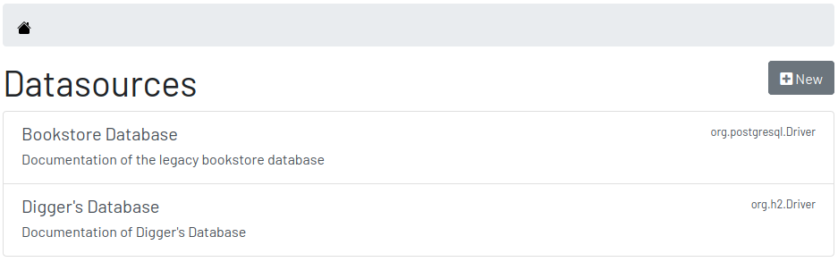

= Digger : User Guide
Hildeberto Mendonca <me@hildeberto.com>
v1.0.0
:doctype: book
:encoding: utf-8
:toc: left
:toclevels: 4
:numbered:

Digger is a light-weight web application to centralize and share the accumulated collective knowledge about all the relational databases of the organization.

== Introduction

After decades of software development, we realized that data is more valuable than software. An application is more likely to be rewritten in a modern technology and continue pointing to an existing database than an existing application be modified to access data from a different database. Of course both cases exist, but applications tend to become more chaotic than databases.

Even with a longer time span, databases are rarely documented. Often, developers have to read the code to understand the meaning of tables, views, columns, and how to use them. It is not rare to find columns and tables that are not referenced at all, but we never know whether they are still in use by an obscure trigger, stored procedure or third-part application. If at least they had a defragmented and up-to-date documentation they could rely on.

== Installation

Digger is easy to install but it requires Java 8 or superior installed and configured in the environment to execute Java-based applications. The application comes with an embedded database for immediate use, but if required, the data can be kept in a PostgreSQL database server, that also needs to be installed and configured separately. These instructions are focused on the installation and configuration of Digger.

=== Installing From the Released File

The first step is to download the installation file from the https://github.com/htmfilho/digger/releases[release page] and save it where we want to install it. This is a compressed zip format with the naming convention: `digger-<version>.zip`. For example: `digger-1.0.0.zip`. Once extracted, the following file structure is created:

    digger-1.0.0.jar
    config/application.properties
    config/application-embedded.properties
    config/application-server.properties

To run Digger with its default configuration, go to the terminal and execute:

    $ cd <path-to-digger-folder>
    $ java -jar digger-1.0.0.jar

10 seconds later, visit the address http://localhost:8080 to use Digger with its embedded database. The folder `data` is automatically created during the initialization, side by side with the `config` folder. The embedded database is robust enough to support any reasonable volume of data, but it won't scale to support multiple concurrent connections. For that, we may need a database like PostgreSQL to handle larger demand for information. To switch to PostgreSQL, stop the application using the [Ctrl+C] shortcut, open the configuration file `application.properties`, and change the following entry to `server`:

    spring.profiles.active=server

Then open the file `application-server.properties` and inform the following connection parameters to connect to PostgreSQL:

    spring.datasource.driver-class-name=org.postgresql.Driver
    spring.datasource.url=jdbc:postgresql://localhost:5432/digger
    spring.datasource.username=digger_usr
    spring.datasource.password=secret

Restart the application to take the new configuration into account:

    $ java -jar digger-1.0.0.jar

Then, refresh the page http://localhost:8080.

=== Installing From the Source Code

A new version of Digger is released from time to time, but if you can't wait for a feature that was just finished, then you may need to build Digger from source. To do it, you basically need https://maven.apache.org/[Maven], a traditional software life-cycle management tool for Java, and https://git-scm.com/[Git], a distributed version control system. Please, visit their respective documentation and get them installed and configured in your system.

To start, fetch the code from GitHub:

    $ git clone https://github.com/htmfilho/digger.git

Then build the project:

    $ cd digger
    $ mvn package

All the artifacts you need are ready! The jar file is now available at `target/` and the configuration files at `config/`. All you need to do now is to put those artifacts together, moving the jar file to the root of the project, so it can "see" the configuration folder:

    $ mv target/digger-1.1.0.jar digger-1.1.0.jar

Then run it just like you did with the released file:

    $ java -jar digger-1.1.0.jar

If you already have Digger installed, just put the generated jar file in the same folder of the existing installation and remove the old jar. Execute the new jar from that point on.

== Security

Digger ensures that only authorized people in the organization are allowed to document and to access the documentation of databases. Users are managed by the application and their passwords are strongly encrypted in the database, to the point they cannot be recovered, only reset.

=== Signing Up

When Digger starts for the first time, it forces the creation of the first user account by automatically redirecting the user to the Sign Up page. The role of administrator (ROLE_ADMIN) is automatically assigned to the first user, who is empowered to manage the application including other users.

.User Sign Up
image::images/signup.png[]

All people signing up after the first user are disabled and assigned to the role of Reader by default. That's why the user cannot login after the sign up. The administrator must enable the user and assign him or her to the appropriate role or leave the user as reader.

=== Login

The login tries to match the user's credentials. If the matching is successful, the user is allowed into the application to access confidential information, otherwise the user is informed that the matching was unsuccessful.

.User authentication
image::images/login.png[]

== Features

Digger gives you a good set of features to help you document the databases of your organization.

[#admin]
=== Administration

The administration is accessible via the top menu, in the "Admin" option. It allows the administrator to manage user accounts.

image::images/administration.png[]

[#admin-users]
==== Users

image::images/users.png[]

===== Enabling a User

===== Changing the Role of a User

[#datasources]
=== Datasources

Datasource is a reference to an existing database that we intend to document. A datasource has enough information to connect to the database and extract metadata from it.

[#datasource-form]
==== Creating and Editing a Datasource

image::images/datasource-form.png[]

[#datasource]
==== The Datasource

[#tables]
=== Tables

Table is a tabular structure used to store, organize and retrieve data. It can be a database table, a temporary table, a view, and other vendor specific alternatives.

image::images/tables.png[]

[#new_table]
==== Documenting a Table

[#table]
==== The Table

[#ignored_table]
=== Ignored Tables

image::images/ignored-tables.png[]

[#new_ignored_table]
==== Ignoring a Table

[#remove_ignored_table]
==== Reconsidering a Table

[#columns]
=== Columns

[#new_column]
==== Documenting a Column

== Contributing to the Project

Follow these instructions if you want to contribute to Digger.

=== Assumptions

We assume your development environment is configured with:

 - **Java 8+**: you can perform the commands `java` and `javac` in your terminal
 - **Maven 3**: you can perform the command `mvn` in your terminal
 - **Git**: you can perform the command `git` in your terminal

=== Local Environment Setup

We favour the use of the command line to set up the local environment, so we do not depend on any other tool for this basic step. Open the Windows/Linux terminal and start by cloning the repository in your local machine:

    $ cd [your-java-projects-folder]
    $ git clone https://github.com/htmfilho/digger.git

It creates the folder `digger` that contains the entire source code of the application. Execute the following Maven command to build, test, and run the application:

    $ cd digger
    $ mvn spring-boot:run

Visit the local address http://localhost:8080/ to use the application. To stop it, type `Ctrl+C` on the terminal.

=== Data Model

The data managed by Digger is persisted in a relational database. If you launched Digger as is, without changing the configuration, you are using the embedded database https://www.h2database.com[H2]. If you are using the server configuration then you are using https://www.postgresql.org/[PostgreSQL]. The data is organized according to the following diagram.

.Digger's Entity Relational Model

=== Deployment

Create a deployment package using Maven:

    $ mvn clean package

It creates a Java standalone application package in the folder `target`.

If the default port `8080` is already in use, set the environment variable `SERVER_PORT` to `8081`.

Run the package to check if everything works:

    $ cd [your-java-projects-folder]/digger
    $ java -jar target/digger-<version>-SNAPSHOT.jar

=== Test Automation

Digger was initially released with very few automated tests. This is not good, but we wanted to give some use to the book https://amzn.to/3cDqTE9[Refactoring], by https://martinfowler.com[Martin Fowler]. This book explains how to refactor the code by first writing tests to ensure the refactoring won't break existing functionalities. So, our approach for testing is basically ensuring regression, increasing test coverage as the application is modified.

To execute the test suite, run:

    $ mvn test

Only submit your pull request if these tests pass. To see the test coverage report, open the page generated at `target/site/jacoco`.

=== Technologies in Use

 - https://docs.spring.io/spring/docs/current/spring-framework-reference/web.html[Spring MVC]
 - https://spring.io/projects/spring-security[Spring Security]
 - http://www.thymeleaf.org[Thymeleaf]
